本周任务为
> * 配置环境，熟悉gcc编译命令的使用
> * 熟悉在文本编辑器上写代码


### Windows
1. 下载windows上的Unix的模拟环境[cygwin](http://www.cygwin.com/),根据自己的机器为64位或者32位，请下载相应版本(如何查看机器位数请自行百度)。

    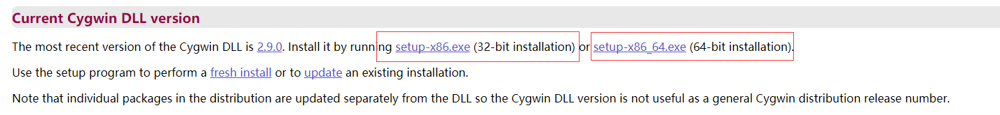

2. 安装cygwin，可以一直点下一步直到`Select Packages`步骤，也可以自行更改设定安装路径。

    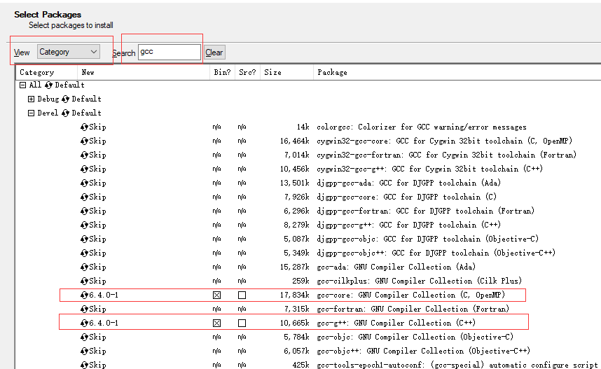

    在view里面选择`Category`,Search里面输入`gcc`，然后在Devel里面选择gcc-core以及gcc-g++（红框已圈出），接着一路点下一步。
3. 打开cygwin terminal，终端的当前路径即对应着如下路径`你的安装路径/home/你的用户名`

    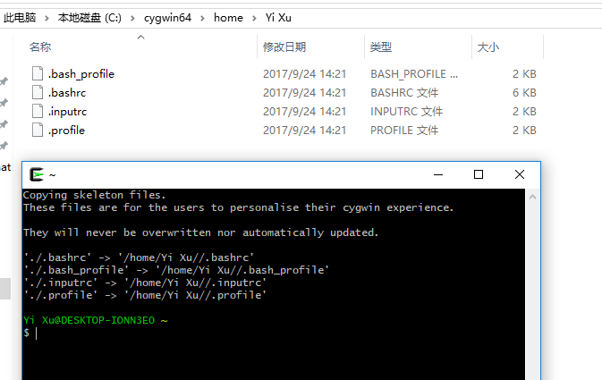

4. 在终端输入命令`mkdir week2`,便可发现在当前路径下多了一个名为'week2'的文件夹（此处文件夹名可自定义）。接着输入`cd week2`，表示进入之前创建的文件夹的路径下。输入`touch aplusb.c`，则会在当前目录下创建一个名为'aplusb'的C文件。

    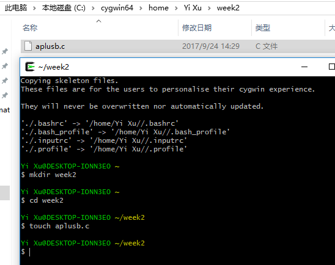

5. 下载文本编辑器，(推荐[notepad++](https://notepad-plus-plus.org/download/v7.5.1.html)或者[atom](https://atom.io/))
6. 使用文本编辑器，打开'aplusb.c'文件。对于notepad++的同学，可以直接右键选用nodepad++打开，使用atom的同学，可以选择在打开方式里选择使用atom打开。当然，也可以在以上两者编辑器中直接去打开相应文件。

    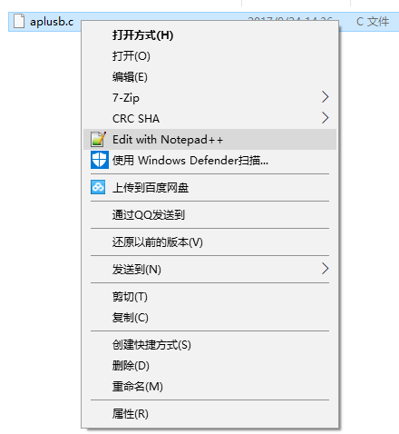

    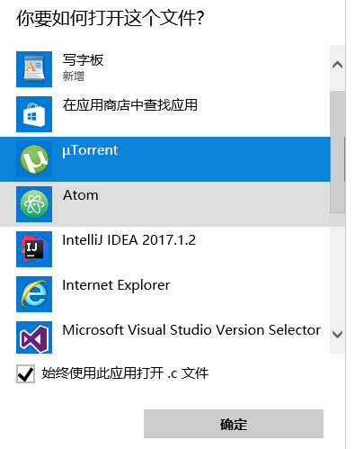

    在notepad++写代码遇到中文为乱码的，请查看文本编码格式是否为utf-8

    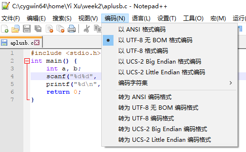

7. 编写代码。
    ```C
    #include <stdio.h>
    int main() {
    	int a, b;
    	scanf("%d%d", &a, &b);
    	printf("%d\n", a + b);
    	return 0;
    }
    ```

8. 现在输入`gcc aplusb.c –o aplusb`来编译该文件，`–o aplusb`表示指定输出（output）文件为`aplusb`，该命令不产生任何输出表示编译通过，否则请根据提示的错误检查你的代码。

    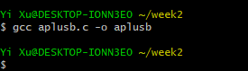
9. 编译成功后可以输入`./aplusb`来执行刚才的程序，其中`.`表示当前目录。下图`5`和`6`是你的输入，`11`是程序的输出。

    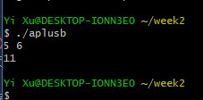


### Linux(Ubuntu等)
都用Linux了。。。肯定应该会。

不需要cygwin，文本编辑器可以使用gedit(自带)，atom等，其余操作大致等同于windows

### Mac

1. 在finder中，按 ⌘, 开启偏好设置，选择“边栏”，勾选home选项（就是你自己的用户名）。现在可以通过finder边栏进入home目录。

    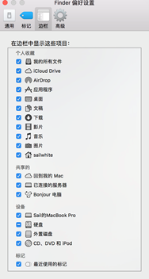

2. 按 ⌘空格 进入spotlight，输入terminal打开终端。现在终端中显示的路径就是刚才finder中打开的home（冒号前面是计算机名，`~`表示当前路径是home，`$`前是当前登陆的用户名。

    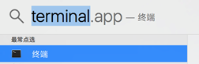

    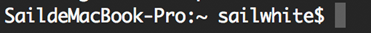

3. 输入`mkdir comp120006.02`新建一个名为comp120006.02的目录，输入`cd comp120006.02`进入该目录，输入`touch aplusb.c`新建一个名为aplusb.c的文件。

    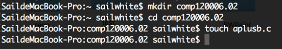

4. 此时，可以在finder中找到刚才新建的文件夹和文件。用文本编辑器（推荐sublime或者atom）打开aplusb.c编辑，输入以下代码，保存。
    ```C
    #include <stdio.h>
    int main() {
    	int a, b;
    	scanf("%d%d", &a, &b);
    	printf("%d\n", a + b);
    	return 0;
    }
    ```
5. 回到终端，输入`cat aplusb.c`可以显示刚才输入的代码。

    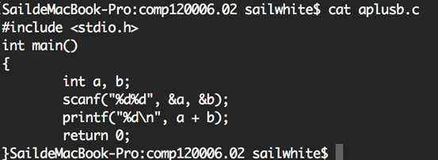

6. 现在输入`gcc aplusb.c –o aplusb`来编译该文件，`–o aplusb`表示指定输出（output）文件为`aplusb`，该命令不产生任何输出表示编译通过，否则请根据提示的错误检查你的代码。编译成功后可以输入`./aplusb`来执行刚才的程序，其中`.`表示当前目录。下图`5`和`6`是你的输入，`11`是程序的输出。

    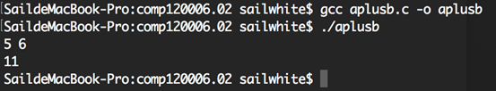
